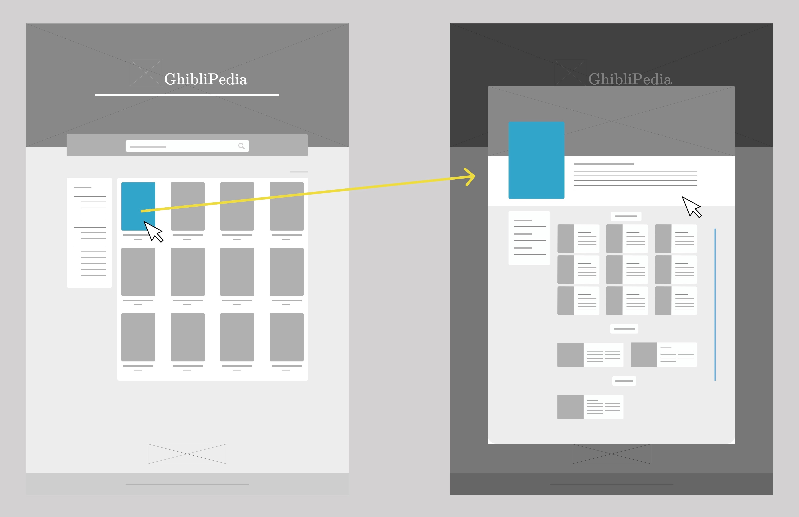
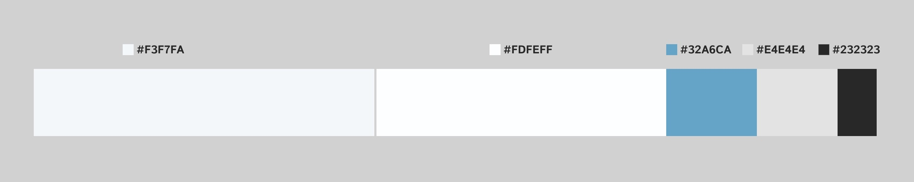

# Data Lovers Ghiblipedia

## Índice

* [1. Descripción del proyecto](#1-descripción-del-proyecto)
* [2. Investigación previa: los principales usuarios de producto](#2-investigación-previa)
* [3. Historias de usuario](#3-historias-de-usuario)
* [4. Proceso de diseño de la interfaz de usuario](#4-proceso-de-diseño-de-la-interfaz-de-usuario)
* [5. Pruebas unitarias](#5-pruebas-unitarias)
* [6. Estado del proyecto](#7-estado-del-proyecto)
* [7. Fundamentos](#8-fundamentos)
* [8. Autoras](#9-autoras)

***

## 1. Descripción del proyecto

Studio Ghibli es un estudio japonés de animación fundado en 1985, considerado por la crítica especializada y muchos cinéfilos como uno de los mejores estudios de animación del mundo en la actualidad.  

Ghiblipedia es una página web donde los usuarios podrán ingresar para conocer las películas de Studio Ghibli, además de información detallada como los directores, los productores, el año de lanzamiento, los personajes, las locaciones, etcétera. La interfaz de Ghiblipedia permite visualizar sets de datos, filtrarlos y ordenarlos. 

## 2. Investigación previa: los principales usuarios de producto

Esta página está dirigida para personas que conozcan o quieran conocer las películas de Studio Ghibli. 

Para conocer las necesidades de nuestro público objetivo, elaboramos una encuesta con las siguientes preguntas: 

* ¿Has visto películas de Studio Ghibli? 

* ¿Dónde sueles ver o has visto estas películas? (Plataforma, sitio web, etcétera) 

* ¿En qué dispositivo sueles ver las películas de Studio Ghibli? 

* ¿Qué opinarías de una página en la que pudieras encontrar información de las películas de Studio Ghibli? 

* ¿Qué información sobre las películas te gustaría encontrar en esta página? 

* Si pudieras elegir dos palabras para describir a Studio Ghibli, ¿cuáles serían? 

  Al recibir las respuestas, nos dimos cuenta de que la mayor parte de nuestro público objetivo suele ver las películas de Studio Ghibli en su computadora de escritorio o laptop, por lo cual priorizamos el diseño de nuestra página para esta vista. Asimismo, nos basamos en las respuestas de la pregunta “Si pudieras elegir dos palabras para describir a Studio Ghibli, ¿cuáles serían?” para elegir el diseño principal y los colores de la página.

  

  

  

## 3. Historias de usuario

  Con base en los resultados de la encuesta realizada a nuestro público objetivo, definimos seis historias de usuario que guiaron el diseño de nuestra página:

### Historia de Usuario 1: Visualización de las películas.

- [ ] **Yo, como nuevo fan de Studio Ghibli, quiero acceder a la página y saber cuántas películas animadas hay y cuáles son.** 

- [ ] **Criterios de aceptación:**

  * Mostrar los títulos, posters y años de lanzamiento de las películas. 

- [ ] **Definición de Terminado:** 

  * Diseño HTML y CSS del índex. 

  * Manipulación dinámica de la data.js para que aparezcan los posters y los títulos de las películas en el index.html.

### Historia de Usuario 2: Búsqueda de películas por título.

- [ ] **Yo, como usuario que no conozco a profundidad Studio Ghibli, quiero poder buscar una película por título en la barra de búsqueda.** 

- [ ] **Criterios de aceptación:**

  * Visualización de una barra de búsqueda.

- [ ] **Definición de Terminado:** 

  * Habilitar la función de ir filtrando al escribir el título de una película en la barra de búsqueda.

### Historia de Usuario 3: Búsqueda y orden de películas por filtros.

- [ ] **Yo, como usuario que conozco o no conozco Studio Ghibli, quiero ser capaz de buscar una película utilizando filtros como clasificación, director o productor, así como ordenar alfabéticamente, por año y por score, de forma ascendente o descendente.** 

- [ ] **Criterios de aceptación:**

  * Visualización del filtro de clasificación para las películas.

  * Visualización del filtro de directores de las películas.

  * Visualización del filtro de productores de las películas.

  * Visualización de un botón desplegable para elegir una categoría para ordenar.

- [ ] **Definición de Terminado:** 

  * Función para filtrado por clasificación. 

  * Función para filtrado por director. 

  * Función para filtrado por productor. 

  * Función para ordenar las películas por título A-Z. 

  * Función para ordenar las películas por título Z-A. 

  * Función para ordenar las películas por año (más recientes primero). 

  * Función para ordenar las películas por año (más antiguas primero). 

  * Función para ordenar las películas por score de Rotten Tomatoes (más altos primero). 

  * Función para ordenar las películas por score de Rotten Tomatoes (más bajos primero). 

### Historia de Usuario 4: Selección de una película. 

- [ ] **Yo, como usuario, quiero poder seleccionar una película y conocer más detalles de ella en una ventana sin que me redirija a una página distinta.** 

- [ ] **Criterios de aceptación:**

  * Visualización de una ventana emergente al hacer click en una película.

- [ ] **Definición de Terminado:** 

  * Estructura básica de HTML para la ventana.

  * Diseño CSS de la ventana.

  * Función para visualizar y ocultar la ventana.

  * Función de scroll.

  * Click para cerrar.

  * Manipulación dinámica de la data.js para que aparezca en el index.html.

### Historia de Usuario 5: Conocer más detalles de una película.

- [ ] **Yo, como usuario, quiero poder conocer más información de una película de Studio Ghibli.** 

- [ ] **Criterios de aceptación:**

  * Visualización de una ilustración en la parte superior de la ventana alusiva a la película. 

  * Visualización del título de la película. 

  * Visualización del póster de la película. 

  * Visualización de la descripción de la película. 

  * Visualización de los personajes de la película. 

  * Visualización de las locaciones de la película. 

  * Visualización de los vehículos de la película. 

  * Visualización de información general de la película en el aside (año de lanzamiento, director, productor, score).

- [ ] **Definición de Terminado:** 

  * Manipulación dinámica de la data.js para que aparezca en la ventana.

### Historia de Usuario 6: Conocer alguna estadística de las películas.

- [ ] **Yo, como usuario, quiero poder visualizar algún cálculo estadístico relacionado con los datos de las películas de Studio Ghibli.** 

- [ ] **Criterios de aceptación:**

  * Visualización de alguna estadística en la página. 

  * Visualización de cuántas películas existen en cada una de las categorías de los filtros (clasificación, directores, productores).

- [ ] **Definición de Terminado:** 

  * Manipulación dinámica de la data.js para que aparezca una estadística en la página.

## 4. Proceso de diseño de la interfaz de usuario

  * Prototipos de baja y alta fidelidad: Una vez definidas las historias de usuario, realizamos los prototipos de baja y alta fidelidad para visualizar las ideas que se formaron a partir de las necesidades de nuestro público objetivo. El diseño del prototipo de alta fidelidad fue diseñado en Figma.

  * Prototipo de baja fidelidad:

  

  * Prototipo de alta fidelidad:

  .jpg>)

  * Colores: A partir de las respuestas de nuestro público objetivo, elegimos la gama de colores para la página y la distribución del contenido.

  

  * Diseño responsive: Se diseñó el proyecto de forma responsiva para que todos los elementos de la página pudieran visualizarse de forma adecuada tanto en las pantallas de computadora como en las de celulares y tabletas. 

  

  * Testeos de usabilidad.

  A partir del feedback que recibimos por parte de nuestras compañeras y coaches, añadimos color al hacer click en una de las categorías para filtrar del lado izquierdo, así como al pasar el cursor por las categorías para ordenar del lado derecho. Además, añadimos un mensaje en el index cuando no se encontraran coincidencias entre el título que ingresó el usuario para buscar y las películas de la data.

  

## 5. Pruebas unitarias

  Construimos las pruebas unitarias de las funciones, las cuales dieron una cobertura de 100% en sentencias, funciones y ramas.

  

## 6. Estado del proyecto

  Se cumplieron todos los objetivos de aprendizaje para el punto de ser entregable, pero se considera en desarrollo porque haría falta completar el ideal del prototipo de nuestro proyecto, como que aparezca una ventana con los detalles de la película al dar click en cada póster.

## 7. Fundamentos

HTML, CSS, JavaScript.

## 8. Autoras

Erika Nagaki y Leslie Garibay, 2023. 